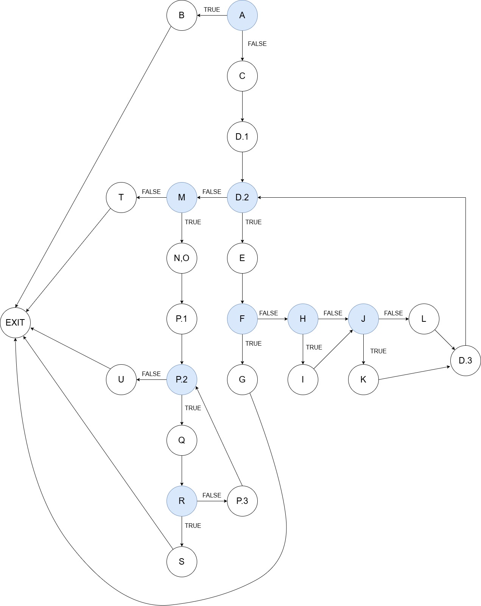

# Втора лабораториска вежба по Софтверско инженерство

## Анамарија Милеска, бр. индекс 211145

##  Control Flow Graph

## Цикломатска комплексност на графот

Цикломатската комплексност на овој код е 9, истата ја добив преку формулата P+1, каде што P е бројот на предикатни јазли. Во случајoв P = 8, па цикломатската комплексност изнесува 9.

## Тест случаи според критериумот Every Statement 

|C0| checkCart(null, "1234567890123456") | Item(null, 100, 0, 1), cardNumber = "1234567890123456" | Item("apple", 100, 0, 1), cardNumber = null | Item("apple", 100, 0, 1), cardNumber = "123456789012345a" | Item("apple", 100, 10, 1), cardNumber = "1234567890123456" |
|-|-------------------------------------|--------------------------------------------------------|---------------------------------------------|-----------------------------------------------------------|------------------------------------------------------------|
|A| *                                   | *                                                      | *                                           | *                                                         | *                                                          |
|B| *                                   |                                                        |                                             |                                                           |                                                            |
|C|                                     | *                                                      | *                                           | *                                                         | *                                                          |
|D.1|                                     | *                                                      | *                                           | *                                                         | *                                                          |
|D.2|                                     | *                                                      | *                                           | *                                                         | *                                                          |
|D.3|                                     |                                                        | *                                           | *                                                         | *                                                          |
|E|                                     | *                                                      | *                                           | *                                                         | *                                                          |
|F|                                     | *                                                      | *                                           | *                                                         | *                                                          |
|G|                                     | *                                                      |                                             |                                                           |                                                            |
|H|                                     |                                                        | *                                           | *                                                         | *                                                          |
|I|                                     |                                                        |                                             |                                                           | *                                                          |
|J|                                     |                                                        | *                                           | *                                                         | *                                                          |
|K|                                     |                                                        |                                             |                                                           | *                                                          |
|L|                                     |                                                        | *                                           | *                                                         |                                                            |
|M|                                     |                                                        | *                                           | *                                                         | *                                                          |
|N|                                     |                                                        |                                             | *                                                         | *                                                          |
|O|                                     |                                                        |                                             | *                                                         | *                                                          |
|P.1|                                     |                                                        |                                             | *                                                         | *                                                          |
|P.2|                                     |                                                        |                                             | *                                                         | *                                                          |
|P.3|                                     |                                                        |                                             | *                                                         | *                                                          |
|Q|                                     |                                                        |                                             | *                                                         | *                                                          |
|R|                                     |                                                        |                                             | *                                                         | *                                                          |
|S|                                     |                                                        |                                             | *                                                         |                                                            |
|T|                                     |                                                        | *                                           |                                                           |                                                            |
|U|                                     |                                                        |                                             |                                                           | *                                                          |

Според Every Statement метода на тестирање, треба да се генерираат test case-ови кои ќе овозможат тестирање на секоја наредба, односно на секој statement од кодот. Test case-овите за оваа метода ги претставив преку табеларен приказ каде во првата колона се означени сите наредби од кодот на функцијата `checkCart()`, и во наредните колони се означени test case-овите со вредностите на променливите на соодветните тестови. Every statement методата налага секоја наредба да биде извршена барем еднаш, па според тоа треба во редицата на секоја наредба да има барем едно пополнето поле. Во полето каде што има `*` означено е дека таа наредба била извршена при извршувањето на соодветниот тест случај. Креирав 5 test case-ови кои ги пополнуваат критериумите за оваа метода на тестирање.

- **Тест 1**: Во овој тест случај не е иницијализирана листа со објектите од класата Items. Поради тоа, вредноста на првата проверка `if (allItems == null)` ќе биде точна и води до фрлање на исклучокот `allItems list can't be null!`, со што е изведена наредбата B. Притоа во овој тест случај, а и во сите наредни тест случаи, секогаш ќе се изведува наредбата А.
- **Тест 2**: Иницијализирана е листа со еден објект за кој нема зададено вредност за променливата name. Поради тоа, вредноста на проверката `if (item.getName() == null || item.getName().length() == 0)` ќе биде точна и води до фрлање на исклучокот `Invalid item!`, со што е изведена наредбата G. Притоа изведени се и наредбите A, C-D.2, F-G.
- **Тест 3**: Иницијализирана е листа со еден објект Item("apple", 100, 0, 1), меѓутоа нема зададено вредност за cardNumber. Ќе се изврши првиот for циклус со тоа што наредбите I и K нема да се извршат поради тоа што вредносите во овој тест пример не се соодветни за извршувањето на тие наредби. Бидејќи нема зададена вредност за cardNumber, вредноста на проверката `if (cardNumber != null && cardNumber.length() == 16)` ќе биде лажна па по тоа ќе се изврши else делот, односно ќе води до фрлање на исклучокот `Invalid card number!`. Со тоа изведена е и наредбата T. Притоа изведени се и наредбите A, C-F, H, J, L, M, T.
- **Тест 4**: Иницијализирана е листа со еден објект Item("apple", 100, 0, 1), меѓутоа вредноста на cardNumber не е исправна, односно се состои од карактер кој не е број. Бидејќи вредностите за објектот се исти како вредностите од претходниот тест случај, проверките за sum ќе бидат исти односно ќе се изведат и нема да се изведат истите наредби. Вредноста на проверката `if (allowed.indexOf(c) == -1)` ќе биде точна и води до исфрлање на исклучокот `Invalid character in card number!`, со што е изведена наредбата S. Притоа изведени се и наредбите A, C-F, H, J, L-S.
- **Тест 5**: Иницијализирана е листа со еден објект Item("apple", 100, 10, 1) и валиден cardNumber = "1234567890123456”. За разлика од тест 3, тест 3 и тест 4, вредноста на discount е 10, па поради тоа во овој тест ќе се изведат и наредбите I и K наместо L. Бидејќи и бројот на картичката е валиден ќе се изведат сите наредби во кодот за проверка на валидноста на бројот, освен наредбата за фрлање исклучок. На крај ќе се изведе и наредбата U, поради тоа што ниту еднаш не се фрлил исклучок претходно. Значи, ќе се изведат наредбите A, C-F, H-K, M-R, U.

Со овие test case-ови се изведуваат сите наредби барем еднаш со што е опфатен критериумот за овој метод на тестирање. Минималниот број на потребни test case-ови е 5.

## Тест случаи според критериумот Multiple Condition

| item.getPrice() > 300 |item.getDiscount() > 0|item.getQuantity() > 10| item.getPrice() > 300 &#124;&#124; item.getDiscount() > 0 &#124;&#124; item.getQuantity() > 10 |Possible Test Case| Expected Output |
|-----------------------|-|-|------------------------------------------------------------------------------------------------|-|-----|
| T                     |X|X| T                                                                                              |Item("apple", 11, 500, 0), cardNumber = "1234567890123456"| 5470.0 |
| T                     |T|X| T                                                                                              |Item("apple", 10, 200, 10), cardNumber = "1234567890123456”| -18030.0 |
| F                     |F|T| T                                                                                              |Item("apple", 20, 100, 0), cardNumber = "1234567890123456”|1970.0|
| F                     |F|F| F                                                                                              |Item("apple", 0, 0, 0), cardNumber = "1234567890123456”|0.0|

Според Multiple Condition методата, треба да се генерираат test case-ови за сите јазли во кои се врши одлучување и тоа во двете можни насоки (true и false). Според насоките за лабораториската вежба, направена е евалуација само за јазолот `if (item.getPrice() > 300 || item.getDiscount() > 0 || item.getQuantity() > 10)`. Test case-овите за оваа метода ги претставив преку табеларен приказ каде првите 3 колони се соодветните аргументи од јазолот и нивната релациона вредност, во 4-та колона е релационата вредност на целиот израз според вредносите во соодветаната редица, и во последните 2 колони се потенцијалните вредности на променливите и очекуваниот исход соодветно. Евалуацијата на релационите изрази ја направив со помош на Lazy Evaluation кој ги елиминира некои од комбинациите на вистинитостите на изразите. Станува збор за „или“ операција, па така треба барем еден од аргументите во јазолот да биде true за да вредноста на целиот релационен израз да биде true. Доколку вредностите на сите аргмуенти се false, тогаш и вредноста на целиот релационен израз ќе биде false. Креирав 4 test case-ови кои ги пополнуваат критериумите за оваа метода на тестирање. За сите test case-ови се користат по еден објект во листата и сите ќе имаат валиден cardNumber = “1234567890123456”.

- **Тест 1**: Поставена е вредноста на првиот аргумент да е true, па со тоа нема потреба да се проверуваат вредностите на останатите два аргумента бидејќи вредноста на целиот релационен израз ќе биде true. Вредностите за овој тест случај би биле 500, 0 и 11 соодветно за цената, попустот и количината на предметот. Очекуваниот резултат би бил 5470.0.
- **Тест 2**: Поставена е вредноста на првиот аргумент да е false, па поради тоа потребно е да се види и вредноста на наредниот аргумент за да се утврди вредноста на целиот релационен израз. Вредноста на вториот аргумент е true, па со тоа нема потреба да се провери вредноста на третиот аргумент. Со тоа заклучуваме дека целиот релационен израз е true. Вредностите за овој тест случај би биле 200, 10 и 10 соодветно за цената, попустот и количината на предметот. Очекуваниот резултат би бил -18030.0.
- **Тест 3**: Поставена е вредноста на првите два аргумента е false, па поради тоа потребно е да се види и вредноста на последниот аргумент за да се утврди вредноста на целиот релационен израз. Вредноста на последниот аргумент е true, па со тоа заклучуваме дека целиот релационен израз е true. Вредностите за овој тест случај би биле 100, 0 и 20 соодветно за цената, попустот и количината на предметот. Очекуваниот резултат би бил 1970.0.
- **Тест 4**: Поставена е вредноста на сите три аргумента да е false, па со тоа заклучуваме дека вредноста на целиот релационен израз е false. Вредностите за овој тест случај би биле сите 0 соодветно за цената, попустот и количината на предметот. Очекуваниот резултат би бил 0.0.

За да се постигне овој критериум на тестирање, потребни се 4 test case-ови.

## Објаснување на напишаните unit tests

Користена е библиотеката **JUnit 5** за да ги напишам unit тестовите. Класите и методите кои ги користев во мојот test file се:

- `org.junit.jupiter.api.Test` → ја вклучува @Test анотацијата која се користи за означување дека одреден метод е тест метод.
- `org.junit.jupiter.api.Assertions.*` → овозможува директно да користам методи без да пишувам Assertions. пред нив со што го прави кодот полесен за читање.
- `java.util.ArrayList` → користена е за помошниот метод createList со цел поедноставно креирање на листа од објекти.
- `java.util.Collections` → исто така е користена за горенаведениот метод.
- `java.util.List` → користен е за декларирање на променлива од тип List<Item>.

Во сите тест методи се користи повик до `SILab2.checkCart()` со различни тест вредности со цел да се покријат сите test case-ови кои ги создадов за соодветните методи. При креирање на листа за тест вредностите ја користам методата `createList()` која е помошна метода. Таа враќа листа која содржи еден елемент бидејќи сите test case-ови ги дефинирав со еден објект во листата.
За тест методот `everyStatementTest()` го користам методот `assertThrows` за да проверам дали се фрлаат соодветни исклучоци за невалидни влезови. За секој очекуван `RuntimeException` користам `assertTrue` за да проверам дали пораката на исклучокот го содржи соодветниот текст. Вклучените исклучоци се кога листата е null, името на објектот е null, и бројот на картичката е невалиден (null или со карактер кој не е број). Исто така го користам методот `assertEquals()` во кој ја проверува точноста на еден тест случај според вредностите за променливите.
За тест методот `multipleConditionsTest()` го користам само методот `assertEquals()` во кој дефинирам очекуван исход според дадените вредности за променливите.
